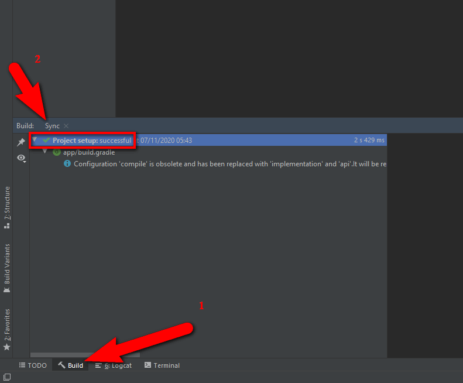

Run everytime before you build want to build app in Android Studio when have changed code in `/src`

```
ionic build --prod
cordova prepare android
```

## Opening a Project in Android Studio

### Import Project

1. Launch Android Studio.

2. Select `Import Project (Eclipse ADT, Gradle, etc)`

3. Select the Android platform directory in your project `/platforms/android`.

4. If have the Gradle Sync question you can simply answer `Yes`


### Verifying Gradle Sync

You need make sure that all working fine before continue Deploy Android application.

When Gradle Sync process completed, make sure it show `synced successfully` and have no any <span style="color:red">`WARNING` with RED color</span>

Otherwise, please try [Do Refactor Gradle](android-deploy.md#do-refactor-gradle) first before contact support.



### Do Refactor Gradle

If your Gralde Sync process have <span style="color:red">`WARNING` with RED color</span> and failed, can not build application then try Do Refactor:

1. Select `Build` panel and hide `Event Log` panel if it showing

1. Expand `Gradle Sync Issues`

1. Select each issue have `WARNING` icon

1. Check if Android Studio suggest Refactor then click and `Do Refactor`, else select other issue in above step


> After check and `Do Refactor` all issues in `Gradle Sync Issues` still not get `synced successfully` at [Verifying Gradle Sync](android-deploy.md#verifying-gradle-sync) then you can contact us with screenshot of issues

## Build and Run your app

There are too many documents about Build and Run application in Android Studio. You can easy search and read [Official Android Studio document](https://developer.android.com/studio/run/index.html)