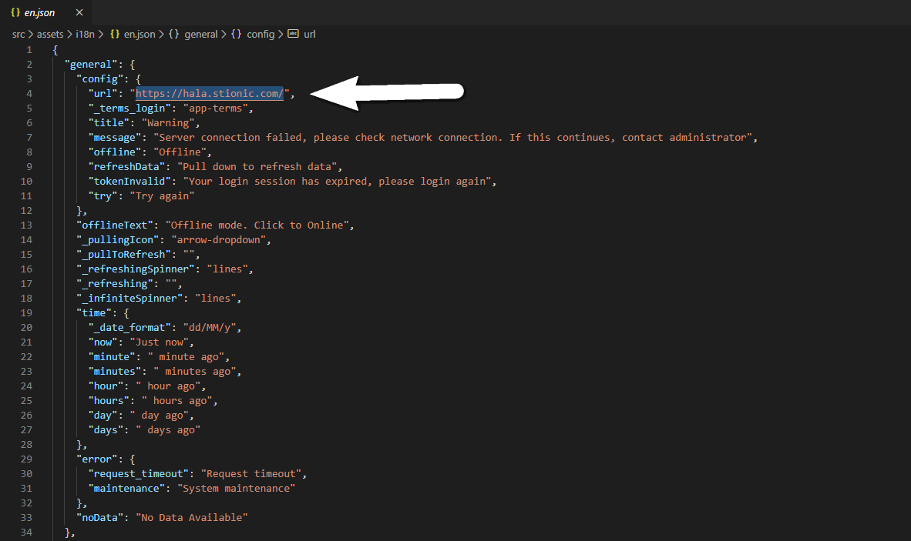
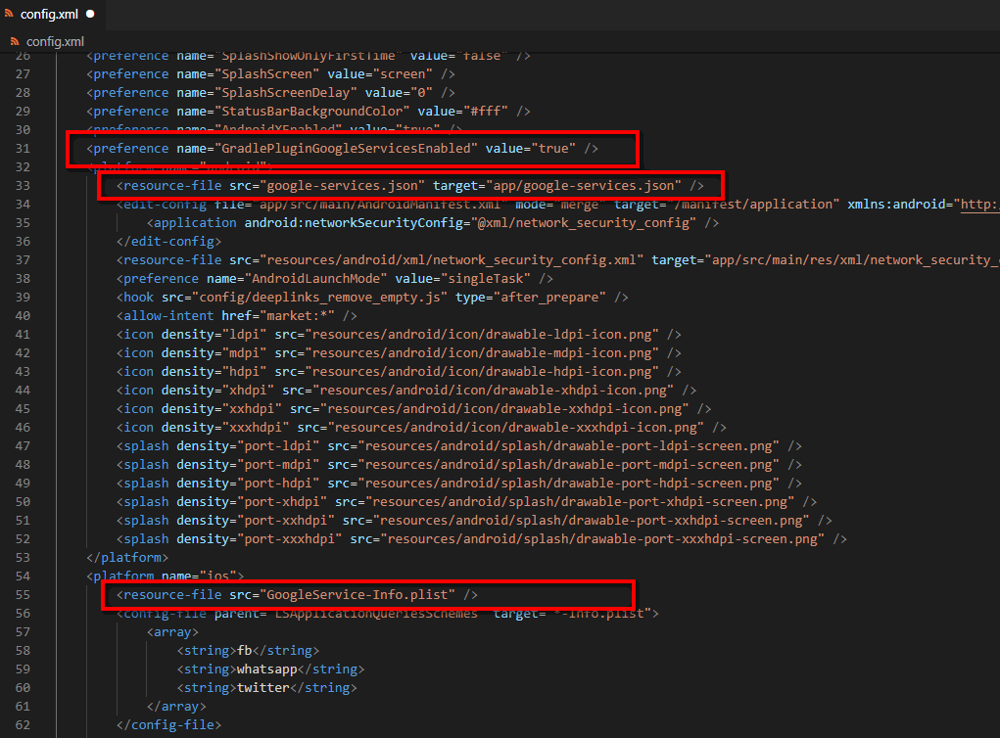

## Connect to WordPress website

Sure, you need to let the app know the URL of your website so that the app can connect.

Very easy, you just need to edit “one line” in `/src/assets/i18n/en.json`

Open en.json file with a text editor and edit `general.config.url` into your URL (line 4)

> Make sure it is final url, after all rediects if have (like forcing HTTPS, www,..)

Tips: you can open your website in browser and wait all load done then copy url in Address bar



## Terms and Conditions page

Default you simple create page in WordPress with slug `app-terms` then app will open this page when click Terms and Conditions in Login.

If you want to change slug just edit in `/src/assets/i18n/en.json`

Open en.json file with a text editor and edit `general.config._terms_login` (line 5)

## App Information

The application should be unique, so you need to provide application information such as ID, version, application name to make sure it is unique.

Just open `/config.xml` file with a text editor and edit


## Google Firebase Analytics

Our app support Google Firebase Analytics and it required config, if not will lead to problem when build.

You can read [Guide Googgle Firebase Analytics](guides-google-analytics.md) document.

If you do not want use this function then need remove config for build without problem.

Open `/config.xml` file with a text editor and remove 2 line

```
<resource-file src="google-services.json" target="app/google-services.json" />
...
<resource-file src="GoogleService-Info.plist" />
```



## Deeplinks (optional)

[Ionic Deeplinks Plugin](https://github.com/ionic-team/ionic-plugin-deeplinks) makes it easy to respond to deeplinks through custom URL schemes and Universal/App Links on iOS and Android.

That means instead of opening your WordPress website in a browser, your device will open the app.

We have pre-configured the application, you just change it so deeplinks can work well.

Open `/package.json` file with a text editor and edit `cordova.plugins.ionic-plugin-deeplinks`

`URL_SCHEME` – the custom URL scheme you’d like to use for your app. This lets your app respond to links like myapp://blah

`DEEPLINK_SCHEME` – the scheme to use for universal/app links. Defaults to ‘https’ in 1.0.13. 99% of the time you’ll use https here as iOS and Android require SSL for app links domains.

`DEEPLINK_HOST` – the host that will respond to deeplinks. For example, if we want example.com/product/cool-beans to open in our app, we’d use example.com here.

`ANDROID_PATH_PREFIX` – (optional): specify which path prefix our Android app should open from [more info](https://developer.android.com/guide/topics/manifest/data-element.html)

Example:

change urlscheme to myapp, then every time the device open myapp:// will open your application.

change yourdomain.com to example.com, then every time browser open http://example.com will open your application.


## Facebook native SDK (optional)

> You need config it if want to use/customize Facebook native SDK in application (like Social login, App events,..)

Open `/package.json` file and edit `cordova.plugins.cordova-plugin-facebook4`


## Google AdMob ads (optional)

If you want to show [AdMob ads](guides-admob-ads.md) in your app then need to config AdMob App ID as [AdMob](https://developers.google.com/admob/ios/quick-start#update_your_infoplist) [required](https://developers.google.com/admob/android/quick-start#update_your_androidmanifestxml)

For Android, open `/package.json` file and edit AdMob App ID `cordova.plugins.cordova-plugin-admob-free`

For iOS, open `/config.xml` file and edit `GADApplicationIdentifier`

Read document [Find your app IDs](https://support.google.com/admob/answer/7356431?hl=en).

