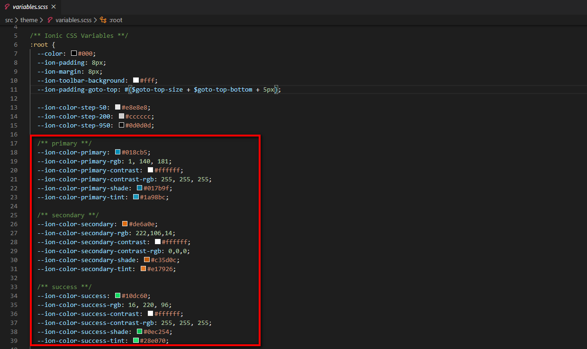
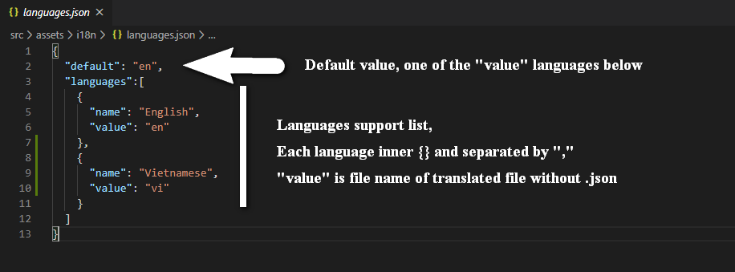
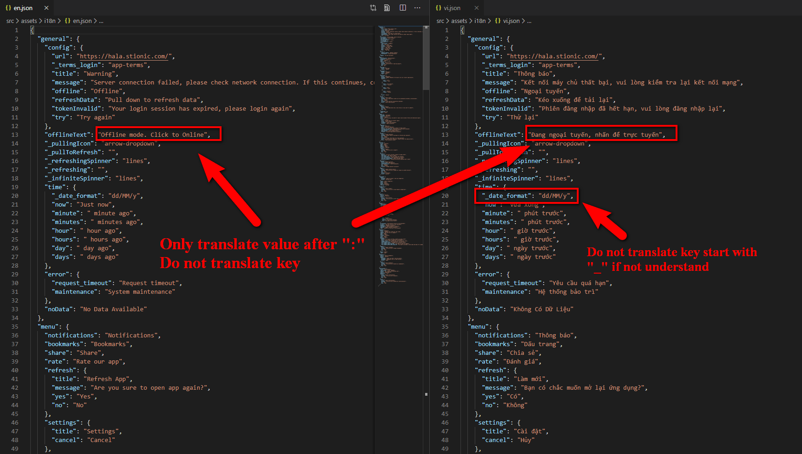

Having many of the same interface applications is not good, we highly recommend that you make certain customizations to create different applications.

## Run on browser

Ionic can run the application on your computer browser. It’s so easy to customize.

> Note: Almost native functions from [Cordova plugin](https://cordova.apache.org/plugins/) will not work when run in web browser.

Run [`ionic serve`](https://ionicframework.com/docs/v3/cli/serve/) to start a local dev server for app dev/testing:


## Customize intro slide

Intro slide image show only first time when users open app after installed. You can use it for show Tips, Guides, Introduction your company,...

Default it will not show, for active intro slide image in your app you need active in `/src/app/app.component.ts` like image below


Default intro slide will have 3 images locate in `assets/imgs/intro` you can replace it.

For remove or add more images you need edit `/src/app/app.html`. In `ion-slides` tag each `ion-slide` is one image, just duplicate then change ` Do this customize if you want your app have a login function.

First install the required plugins:

[Stionic Users](https://wordpress.org/plugins/stionic-users/) – extend API endpoint for manager users

[JWT Authentication for WP REST API](https://wordpress.org/plugins/jwt-authentication-for-wp-rest-api/) – allow authentication with token

Make sure you have configured JWT.

Add to end of .htaccess

```
#BEGIN JWT
RewriteEngine on
RewriteCond %{HTTP:Authorization} ^(.*)
RewriteRule ^(.*) - [E=HTTP_AUTHORIZATION:%1]
SetEnvIf Authorization "(.*)" HTTP_AUTHORIZATION=$1
# END JWT
```

Add to wp-config.php after `<?php` (line 2)

```
define('JWT_AUTH_SECRET_KEY', 'your-top-secrect-key');
define('JWT_AUTH_CORS_ENABLE', true);
```

> ‘your-top-secrect-key’ should change to any secret random string. Let your cat jump on keyboard :)

If you want allow users login with Facebook, install [Nextend Social Login](https://wordpress.org/plugins/nextend-facebook-connect/) and config it.


And in [Facebook developer app dashboard](https://developers.facebook.com/apps) you need to provide platform information for each platform you deliver your app on Facebook app.

For each platform, click `Add Platform` under Settings | Basic:

- iOS: Step 3 in this document:

https://developers.facebook.com/docs/facebook-login/ios

- Android: Step 5, 6 and 7 in this document:

https://developers.facebook.com/docs/facebook-login/android

## Change images

All images of the application locate at `/src/assets/imgs`

You can replace any image you want (like menu image, nodata image, thumbnail post, avatar user, etc…)

## Change colors

To change the color of the application please edit at `/src/theme/variables.scss`

Open it with a text editor and edit value in `$colors`

Change the hex color and all corresponding colors in the application will change.



## RTL Language

The application support RTL language, if you want you just edit the 2 files:

* `/src/index.html`

* `/src/theme/variables.scss`


## Multiple languages & Translate app

The application support multiple languages, archived at `/src/assets/i18n`

Include config file (languages.json) and translated files (en.json, vi.json,…)



To add multiple languages, duplicate any translated file and rename it to the language identifier. Then declarations in `languages.json`.

> Example: duplicate `en.json` and rename to `vi.json`. Then declarations in `languages.json` as image above.

[language] below is a replacement for translated file (en.json, vi.json,…)

To translate the application, simply edit the `/src/assets/i18n/[language].json` file.

> Data in JSON format, just edit the value, never modify the key and the value of key named `"value"` if you don’t understand.

