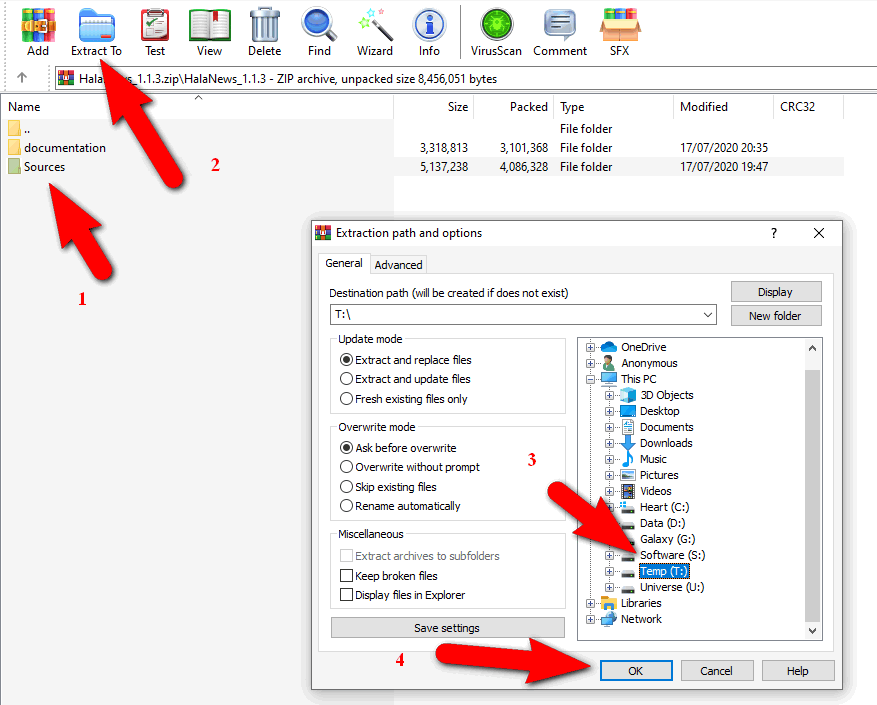

> You need to connect to the network

## Install Cordova and Ionic framework

1. Goto [Download page Node.js](https://nodejs.org/en/download/) get LTS version (make sure is LTS version).

1. Once the download is complete, open Node.js installer.

1. Simply follow the prompts in the installer.

1. Run the Terminal installation script: `npm install -g cordova ionic`

## Install WordPress plugin

As you know, our news application was designed for WordPress. If you already have a WordPress website, it is too simple! Otherwise, take a moment to learn about [WordPress](https://wordpress.org/).

Then just install plugin [Stionic core](https://wordpress.org/plugins/stionic-core/) to complete Backend process.

## Install Node modules

Extract Sources folder in .zip you get when purchase to wherever you want, you also can change Sources folder name.



> All Terminal commands from now should run in Sources folder

1. `cd Sources`

1. Run the Node modules initialization script `npm install`


## Verifying Installation

After installation process you need check and verify that all working fine by run `ionic info`


Along with previously existing files and directories, your root project directory will now contain a structure similar to:

```bash
root-directory
├── config
├── node_modules
├── resources
├── src
│   ├── app
│   ├── assets
│   ├── components
│   ├── pages
│   ├── pipes
│   ├── providers
│   ├── theme
│   ├── validators
│   ├── index.html
│   ├── manifest.json
│   └── service-worker.js
├── config.xml
├── ionic.config.json
├── package.json
├── tsconfig.json
└── tslint.json
```