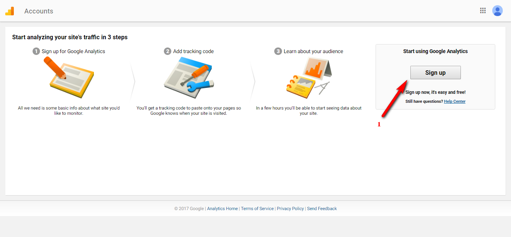
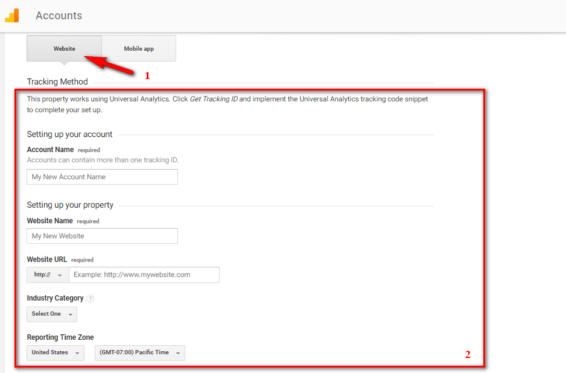
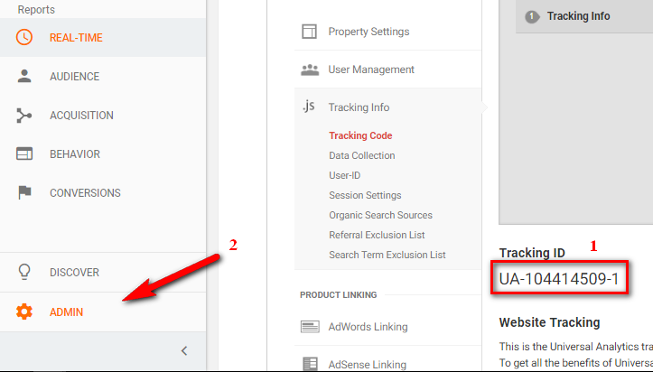
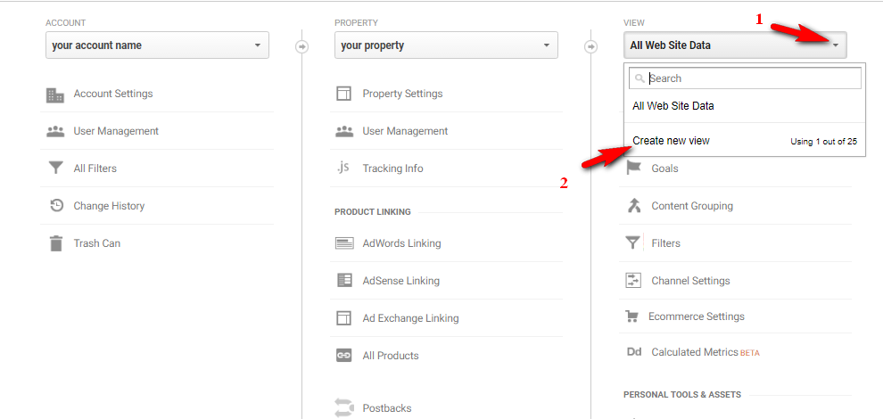
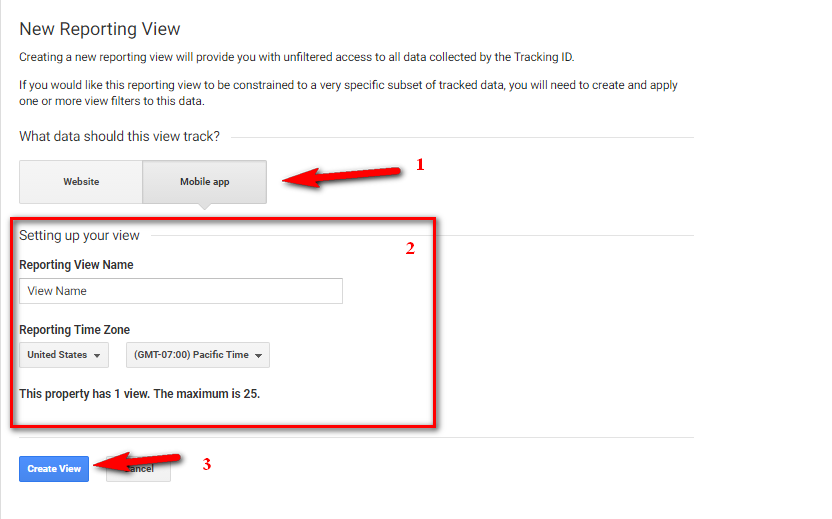

Google Analytics is a freemium analytics service, that tracks and reports traffic. You can use this great service to track user behavior, also of concern on WordPress mobile app to have good tactics.

* First, login to [Google Analytics](https://analytics.google.com/), if you never used Analytics before, click `Sign Up`. Otherwise, you can create a new property.

* Select property for `Website`, then fill in information and click `Get Tracking ID`. As a result you will get a Tracking ID, config it in [General Setting](guides-setting.md#general-setting).

* Now click `ADMIN` go to Admin page. In View, click `Create new view`

* Select `Mobile app`, input infomation and click `Create View`. Done!

