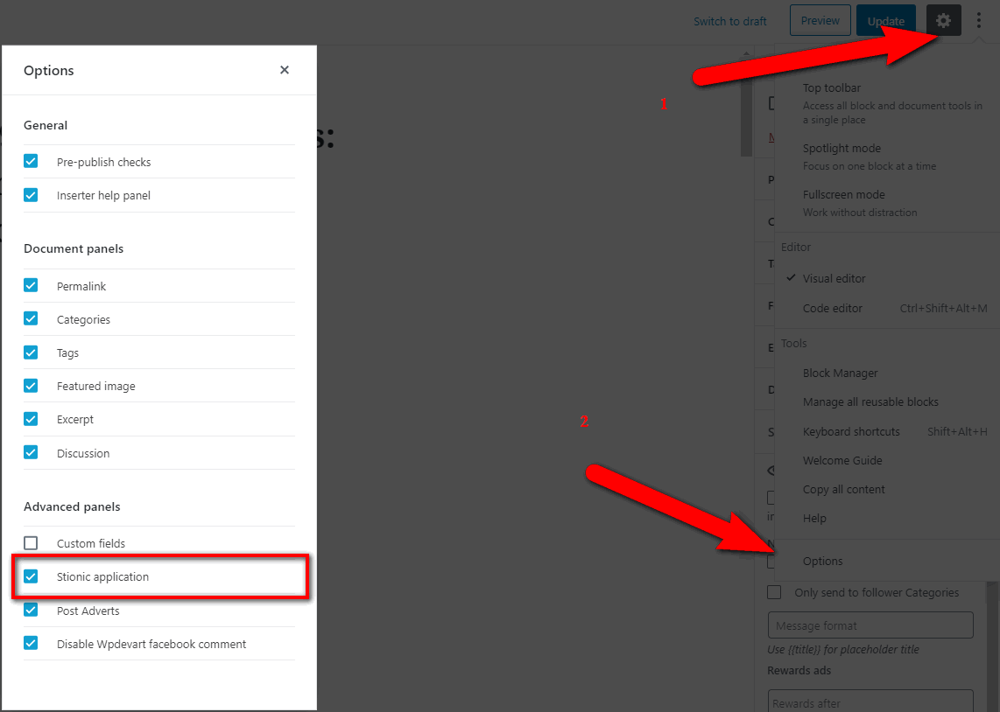
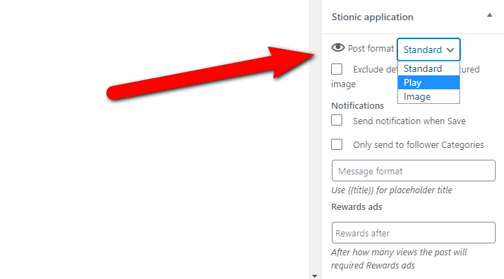
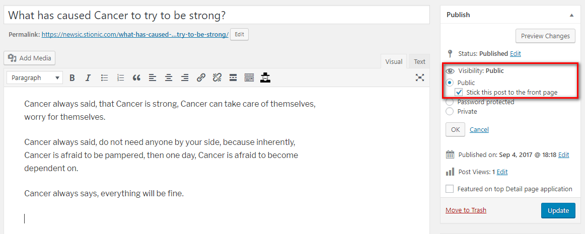
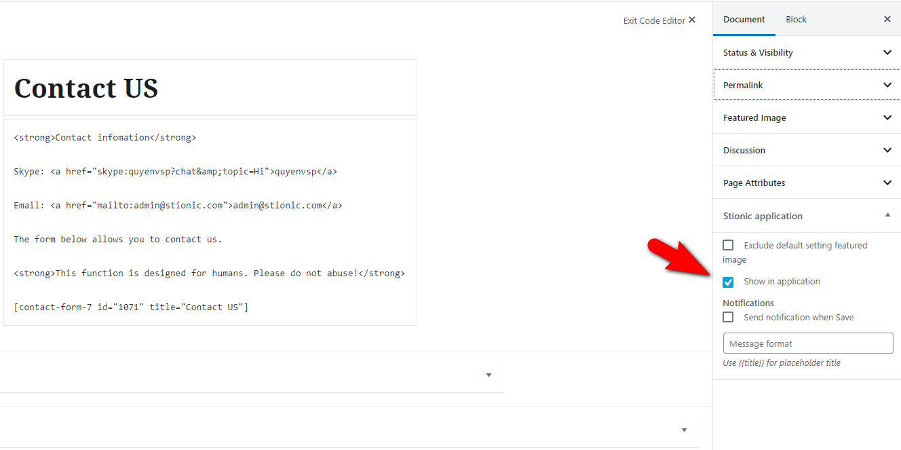

## Stionic application panel

Our Stionic core plugin added Stionic application panel when edit posts / pages for some functions

If when edit posts / pages not see it then you need enable in `More tools & options -> Options`

### Show posts in Video / Images tab

Video and Images tab in home page of application show posts have format is Play / Images.

When edit posts you just setting format and save.

### Show reward ads for read posts

You can setting required users view Rewards ads for read posts content.

Example:

Empty - not required view Rewards ads for this posts

1 - Users always need view Rewards ads when want to read this posts

10 - After view Rewards ads users have 10 times read this posts (Rewards ads will show again in 11, 21, 31,...)

## Homepage Slide

The home page slide will display sticky posts, just set "Stick this post to the front page" while editing posts.

## Categories Images

We use the wordpress plugin Categories Images to manage categories images.

So you need to install [Categories Images](https://wordpress.org/plugins/categories-images/) plugin.

Then login `Wordpress Admin -> Posts -> Categories`. Add/Edit a category and you will see "Image" input.

## Contact Form

We use the wordpress plugin Contact form 7 to manage contact form.

So you need to install [Contact form 7](https://wordpress.org/plugins/contact-form-7/) plugin, then login `Wordpress Admin -> Contact` and Add new contact form.

## Show WordPress page in menu

Maybe you want to show some WordPress pages in Side menu of application like Contact, Terms & Condition, Privacy Policy,...

Already support and so easy, when edit WordPress pages just check `Show in application` in Stionic application panel.

