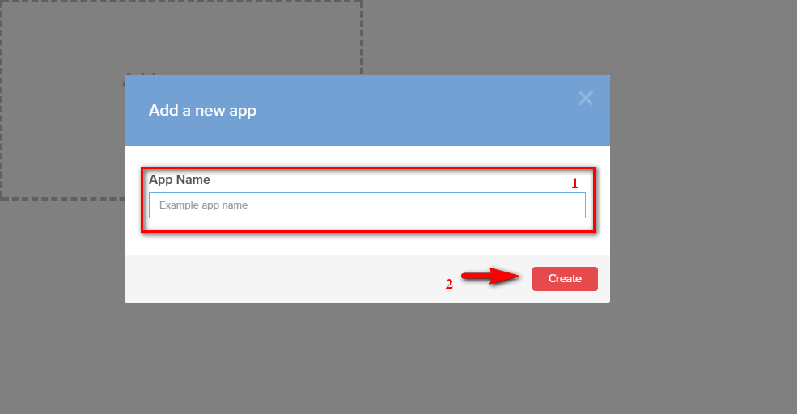
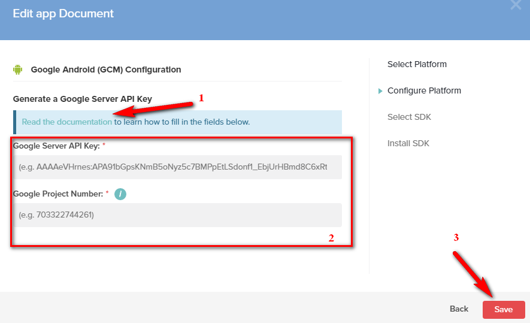
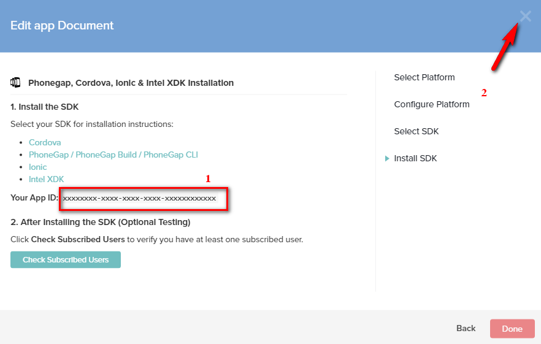
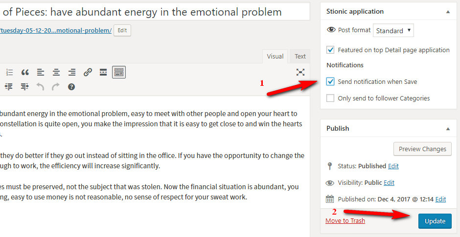
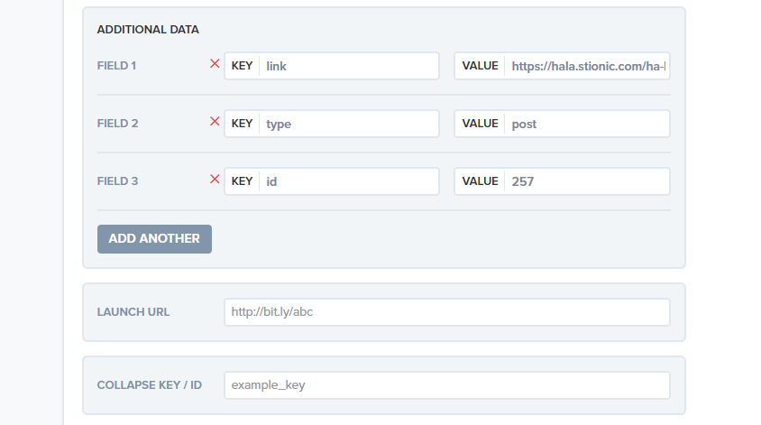

OneSignal is a multi-platform push notifications service. You can use this to send notifications to users on mobile WordPress app. In addition supports a lot of great features. And it is free, so we should thank OneSignal.

## Create and Config OneSignal

* First, login to [OneSignal](https://onesignal.com/), click `Add a new app` to create new project. Then input App name and click `Create`

* After successfully creating, you need to configure project.

    – `Platform`: your project can support multiple platforms (you can add later) but you first need to choose a platform.

    – `Config Platform`: each platform has a different way of sending messages, OneSignal has document detailed for configuration. Open in new tab `Read the documentation`

    Once you have all the necessary information, go back to OneSignal and fill in the form, click `Save`

    – `SDK`: select PhoneGap, Cordova, Ionic, Index XDK click `Next`

* Once the configuration is complete, you will receive the OneSignal App ID. config it in [OneSignal Setting](guides-setting.md#onesignal-setting)

* So whenever you select “Send notifications on Save” on Stionic application panel, it will send a notifications to the user.

## Send notification with OneSignal dashboard (optional)

You can also use the OneSignal Dashboard to send notifications manually with more customize.

For open post when click notification you need use `Additional data` when send notification with follow key and value:

* link: any url you want to open, if is url of post then app will open post, also support page, category,.. 
* type: (optional) 'post' or 'page'
* id: (required if have 'type' data) id of post or page

