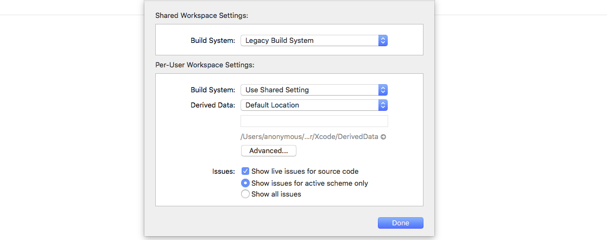

Run everytime before you build want to build app in XCode when have changed code in `/src`

```
ionic build --prod
cordova prepare ios
```

## Opening a Project in XCode

Simple open `.xcworkspace` file in `/platforms/ios/` with Xcode.

## Setting Legacy build system

After open project in XCode, you need make sure that Build system is Lagacy

1. `File > Workspace Settings`

1. In Build System select `Legacy Build System`

1. Done



## Build and Run your app

There are too many documents about Build and Run application in XCode. You can easy search and read [Official XCode document](https://developer.apple.com/library/archive/documentation/ToolsLanguages/Conceptual/Xcode_Overview/BuildingYourApp.html)